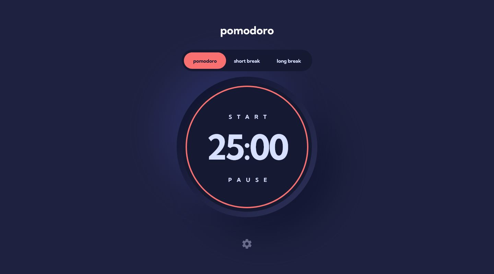
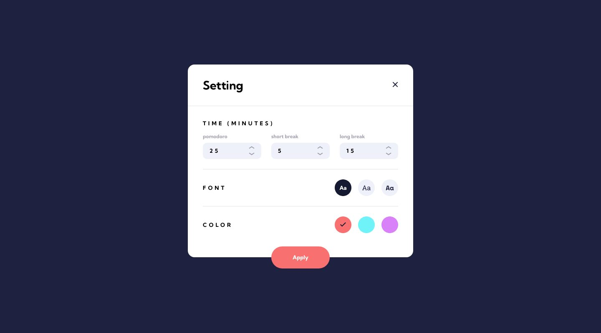

# Frontend Mentor - Pomodoro app solution

This is a solution to the [Pomodoro app challenge on Frontend Mentor](https://www.frontendmentor.io/challenges/pomodoro-app-KBFnycJ6G). Frontend Mentor challenges help you improve your coding skills by building realistic projects. 

## Table of contents

- [Overview](#overview)
  - [The challenge](#the-challenge)
  - [Screenshot](#screenshot)
  - [Links](#links)
- [My process](#my-process)
  - [Built with](#built-with)
  - [What I learned](#what-i-learned)
  - [Continued development](#continued-development)
  - [Useful resources](#useful-resources)
- [Author](#author)

## Overview

### The challenge

Users should be able to:

- Set a pomodoro timer and short & long break timers
- Customize how long each timer runs for
- See a circular progress bar that updates every minute and represents how far through their timer they are
- Customize the appearance of the app with the ability to set preferences for colors and fonts

### Screenshot

### Links

- Solution URL: [https://github.com/2emeagauche/frontend-mentor-pomodoro-app](https://github.com/2emeagauche/frontend-mentor-pomodoro-app)
- Live Site URL: [https://2emeagauche.github.io/frontend-mentor-pomodoro-app/](https://2emeagauche.github.io/frontend-mentor-pomodoro-app/)

## My process

As i didn't find the specifications clear I've made up a personal version.
I put a start button that starts the pomodoro timer. This button turns to a stop button on start.
The timer is set to time out 25mn of work then 5mn short break.
It is looping 4 times then a 15mn long break. After what the cycle starts again ad lib.
On the stop button the timers are reseted.
I put a pause button that pause whatever the timer is running.

### Built with

- CSS Sass and custom properties (for theming)
- Flexbox
- CSS Grid
- Mobile-first workflow
- [React](https://reactjs.org/) - JS library

### What I learned

- I have used a library to manage the timers: "advanced timer" by Sergi Guzman
- I now have a better understanding of React useEffect.
- I've created a custom hook in which the timers logic dwells.
- I've used custom properties to deal with the colors and fonts theming.

### Continued development

- I should add comments in my code.
- I could refactor my code to start the timers by clicking the steps indicators (pomodoro, short break, long break)
- I should use Typescript

### Useful resources

- [Time to focus!](https://pomofocus.io/) - Nice example of a live pomodoro app
- [advanced timer](https://github.com/colxi/advanced-timer) - by Sergi Guzman
- [Theming with custom properties](https://youtu.be/fyuao3G-2qg?si=OLVsUEFb8W08KWC-) - A video youtube by Kevin Powell!
- [can't position html legend tag with css grid](https://stackoverflow.com/questions/62692452/cant-position-html-legend-tag-with-css-grid) - I was strugling to apply flex or grid to the fieldset/legend elements. There was the solution!

## Author

- Github - [@2emeagauche](https://2emeagauche.github.io)
- Frontend Mentor - [@2emeagauche](https://www.frontendmentor.io/profile/2emeagauche)